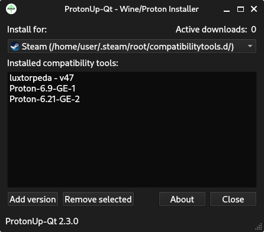

# ProtonUp-Qt
Install and manage [GE-Proton](https://github.com/GloriousEggroll/proton-ge-custom) and [Luxtorpeda](https://github.com/luxtorpeda-dev/luxtorpeda) for Steam and [Wine-GE](https://github.com/GloriousEggroll/wine-ge-custom) for Lutris with this graphical user interface. Based on AUNaseef's [ProtonUp](https://github.com/AUNaseef/protonup), made with Python 3 and Qt 6.  

## Download from Flathub or as AppImage (portable):
  

Website: [https://davidotek.github.io/protonup-qt](https://davidotek.github.io/protonup-qt)

## Install from AUR: (Arch, Manjaro, EndeavourOS, etc.)

### Source 
https://aur.archlinux.org/packages/protonup-qt (Maintained by yochananmarqos)

### Binary (Appimage)
https://aur.archlinux.org/packages/protonup-qt-bin (Maintained by R1yuu)

## Run from source
### Install dependencies
`pip3 install -r ./requirements.txt`
### Run ProtonUp-Qt
`python3 -m pupgui2`

## Build AppImage
### Install dependencies
1. Install appimage-builder: https://appimage-builder.readthedocs.io/en/latest/intro/install.html  
### Build AppImage
`appimage-builder`

## Translate ProtonUp-Qt
**Recommended: You can translate ProtonUp-Qt on Weblate: https://hosted.weblate.org/projects/protonup-qt/**

1. Generate an empty translation file *or* copy a template from [here](https://github.com/DavidoTek/ProtonUp-Qt/blob/main/i18n/pupgui2_de.ts).
2. Install [Qt Linguist](https://flathub.org/apps/details/io.qt.Linguist) (alternatively: edit the **.ts** file using a text editor).
3. Open the translation file (.ts) with Qt Linguist and translate the app.
4. The app summary can be found [here](https://github.com/DavidoTek/ProtonUp-Qt/blob/main/share/metainfo/net.davidotek.pupgui2.appdata.xml#L7).
5. The comment inside the .desktop file can be found [here](https://github.com/DavidoTek/ProtonUp-Qt/blob/main/share/applications/net.davidotek.pupgui2.desktop#L6).
6. Submit the translation:   
   a) Create a Pull Request with the translation  
   b) Simple method: Alternatively, upload the **.ts** file/texts [here](https://gist.github.com/) and [create a new issue](https://github.com/DavidoTek/ProtonUp-Qt/issues/new?labels=translation&title=Translation:%20language) with a link to your translation.  

## Licensing
Project|License
-------|--------
ProtonUp-Qt|GPL-3.0
[ProtonUp](https://pypi.org/project/protonup/)|GPL-3.0
[PySide6](https://pypi.org/project/PySide6/)|LGPL-3.0/GPL-2.0
[inputs](https://pypi.org/project/inputs/)|BSD
[pyxdg](https://pypi.org/project/pyxdg/)|LGPLv2
[vdf](https://pypi.org/project/vdf/)|MIT
[requests](https://pypi.org/project/requests/)|Apache 2.0
[PyYAML](https://pypi.org/project/PyYAML/)|MIT
