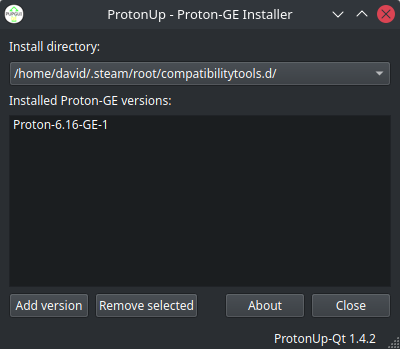

# ProtonUp-Qt
Qt-based graphical user interface to install and manage [Proton-GE](https://github.com/GloriousEggroll/proton-ge-custom) installations for Steam. Based on AUNaseef's [ProtonUp](https://github.com/AUNaseef/protonup).  
**Download newest release AppImage from [here](https://github.com/DavidoTek/ProtonUp-Qt/releases).**  

## Run from source
### Install dependencies
`pip3 install -r ./requirements.txt`
### Compile GUI
`pyside6-uic ui/protonup_mainwindow.ui > pupgui/protonup_mainwindow.py`
### Run ProtonUp-Qt
`python3 pupgui/pupgui.py`

## Build AppImage
### Install dependencies
1. Install appimage-builder: https://appimage-builder.readthedocs.io/en/latest/intro/install.html  
2. Install PySide6: `pip3 install pyside6`
### Build AppImage
`appimage-builder`

## Licensing
Project|License
-------|--------
ProtonUp-Qt|GPL-3.0
[ProtonUp](https://pypi.org/project/protonup/)|GPL-3.0
[PySide6](https://pypi.org/project/PySide6/)|LGPL-3.0/GPL-2.0
